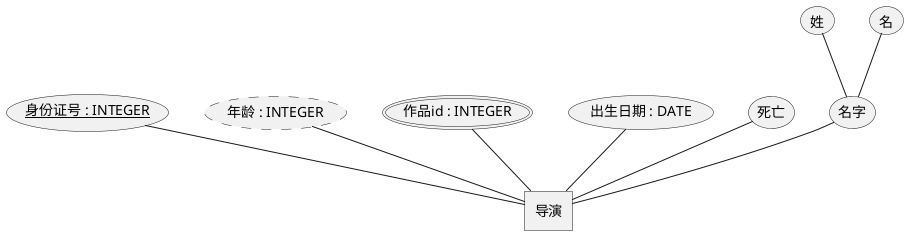
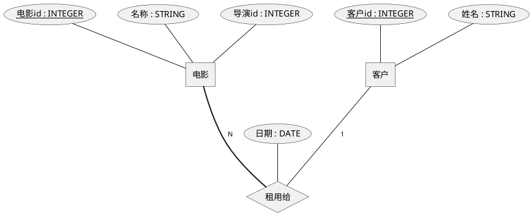
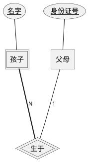

# ER图
又称实体-关系图，是一种用来描述实体和实体之间关系的图表。
## 基本元素
* Entity 实体，一个对象，表示数据库要存储的信息；矩形表示
  * 弱实体；双矩形表示（回）
    判断实体是否是弱实体：看该实体是否完全依赖于另一个实体来唯一标识。
* Attribute 属性，描述**实体**或**关系**的特征；椭圆形表示
  * 唯一属性，下划线表示
  * 非唯一属性
  * 多值属性，双椭圆表示
    理论上应该是个一对多的关系，但没必要。
  * 派生属性，从其他属性派生而来，用虚线椭圆表示
    从其他属性推导来的，比如年龄可由生日推导而来
* Relationship 关系，描述实体之间的联系；菱形表示
  * 一对一；一对多；多对多；1代表一，N代表多
  * Identifying 标识关系（识别关系） 用以标识弱实体与其依赖的强实体之间的关联。
    强实体的主键作为弱实体的主键的一部分，从而唯一标识弱实体的实例。
  * 用实线标识关系与实体的关联，用粗线或双线标识强关联（强制参与）。
## 笔记
### 实体与属性
水平布局、主键、派生属性、多值属性、组合属性（DB中多列）

### 关系
关系属性、关系数量、实体别名、属性别名、强制关联

### 标识关系 Identifying
弱实体
孩子的主键由父母的身份证+孩子的姓名标识。

### 还有继承？
符号来自集合论.... 用上时再看吧。

