## 序列图
### 基本元素
* Actor与Object 系统外部的实体或系统内部的实例。
* Lifeline 存在的时间段，垂直虚线
* Activation 激活状态
* Message 对象间的通信，同步消息（带箭头的实线）、异步消息（带箭头的虚线）、返回消息（虚线带箭头）。
* Self-Message 自消息，比如递归或内部方法。
* Combined Fragment 组合片段，[详情](https://www.cnblogs.com/cy568searchx/p/6227238.html)
* Delete 删除，对象声明周期的结束，用`X`标记在Lifeline上。
* Note 注释，文本说明。
### 笔记
#### 基本例子
    同步消息、异步消息、消息说明、注释
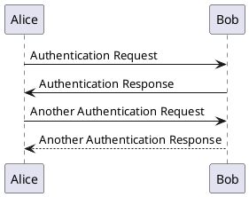
#### 声明参与者
    对象类型、对象别名、显示顺序、对象多行定义、Message文本对齐
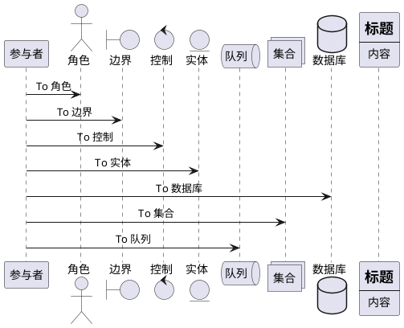
#### 参与者非字母
    字符串参与者、参与者别名、说明换行、自消息
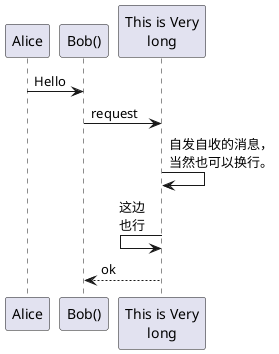
#### 箭头样式与颜色
    消息自动编号
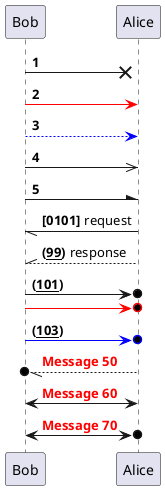
#### 标题页眉页脚
    分页、隐藏脚注
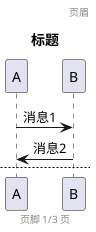
#### 组合消息
    次级分组标签、包裹参与者、页面框架
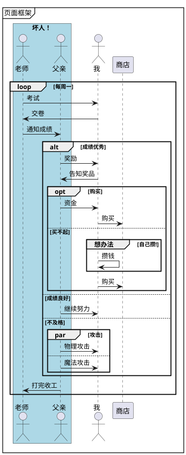
#### 注释
    参与者注释、注释左/右、注释颜色、注释框样式（长方、六边）、分隔符、延迟、空间
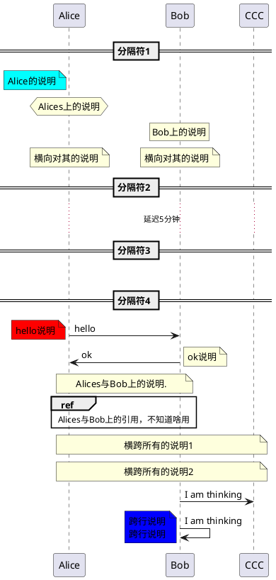
#### 生命线
    激活、关闭、销毁
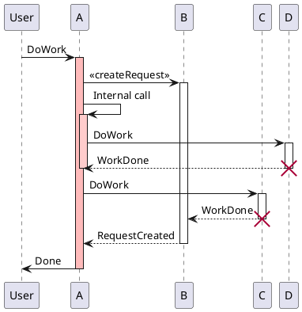
#### 快捷语法
    激活、撤销、创建、摧毁、无源头、缩进箭头
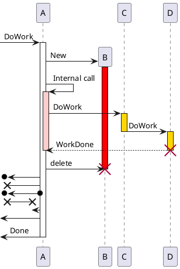
#### 返回 - 没太理解
    自动激活、返回
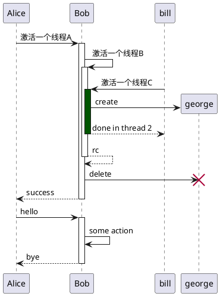
#### 创建参与者
    用以强调消息的作用是创建对象.
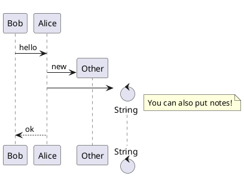
#### 锚点和持续时间
    需要指定`java -jar plantuml.jar -Pteoz=true`
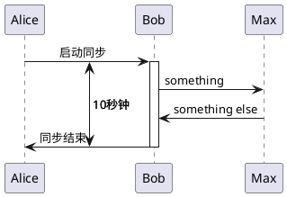
#### 构造类型和圈点
    构造型（stereotype）位置
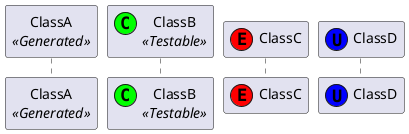
#### 斜线与双箭头
    激活、关闭、销毁
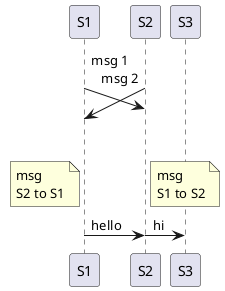
