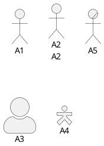
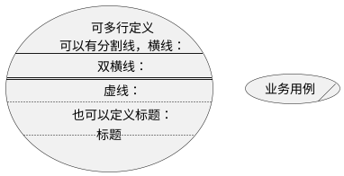
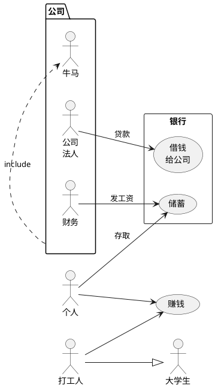
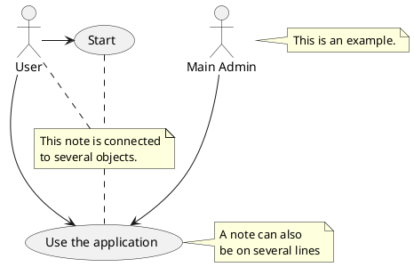
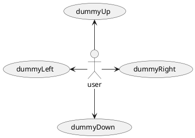
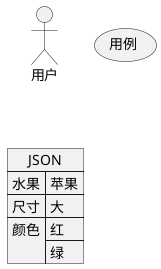

## 用例图
### 基本元素
* Actor 与系统交互的外部实体，用户或其他系统
* Use Case 系统提供的一个服务或功能
* System Boundary 长方形表示，包围所有Use Case，表示系统边界
* Association 关联，Actor与Use Case之间的关系
* Include Relationship 一个用例包含另一个用力的行为，带有`<<include>>`标签的虚线箭头
* Extend Relationship 一个用例在特定条件下会扩展另一个用例的行为，带有`<<extend>>`标签的虚线箭头
* Generalization 泛化，角色之间或用例之间的继承关系，带箭头的实线表示，箭头指向更通用的角色或用例
### 笔记
#### 角色
    角色样式、商业行为者

#### 用例描述
    业务用例

#### 包
    包的外观、箭头长度、箭头标签、简写、继承、排布方向、包也可以连线、显示json

#### 注释
    定义注释、链接到对象

#### 箭头方向

#### 显示Json数据

