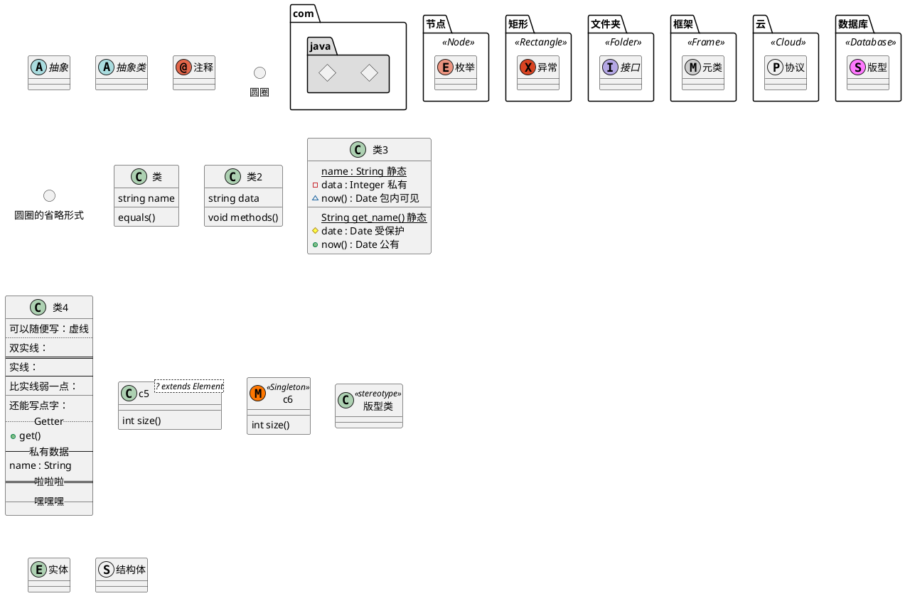
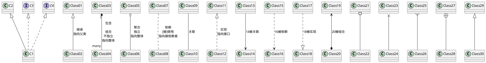
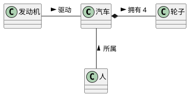
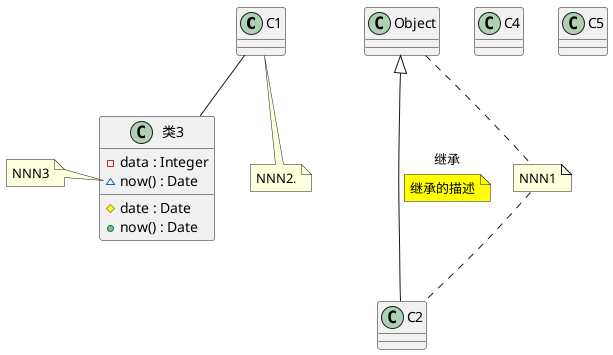
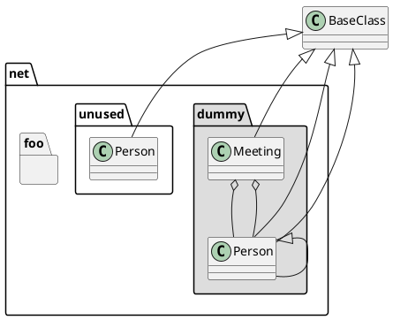
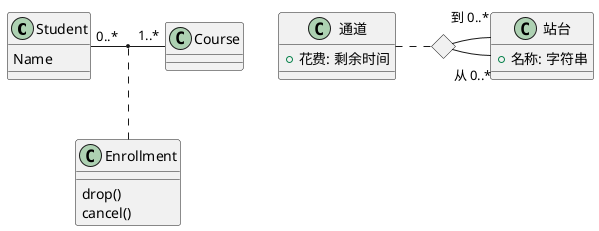

## 类图
### 笔记
* Class 包含类名、属性（数据类型与可见性）、方法
* Interface 方法的集合，带有`<<interface>>`标记的矩形
* Relationships 关系
  * Association 关联关系
  * Generalization 继承关系，空心三角实线，指向父类
  * Realization 实现，空心三角虚线，指向接口
  * Aggregation 聚合，整体与部分的关系（部分可独立存在），空心菱形实线，指向整体
  * Composition 组合，整体与部分的关系（部分不独立存在），实心菱形实线，指向整体
  * Dependency 依赖，类之间的使用关系，箭头虚线，指向被依赖者。
* Enumeration 枚举
* Note 注释
### 笔记
#### 元素声明
    添加属性与方法、属性与方法修饰符、可见性、静态方法、泛型、指定标记

#### 类之间关系
    关系上的标签

#### 说明作用在谁身上

#### 备注
    注释属性或方法、注释链接、隐藏类、删除类、标签、隐藏未关联的

#### 命名空间

#### 箭头方向
    `-up->` 改变箭头方向
#### 关系类
