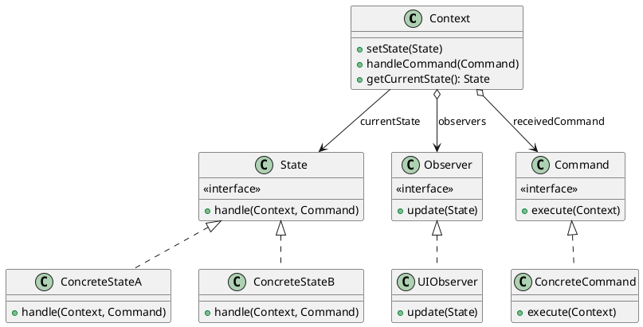
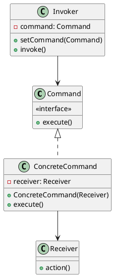
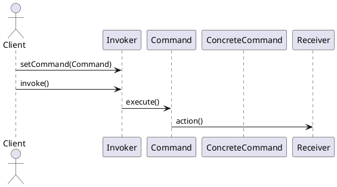
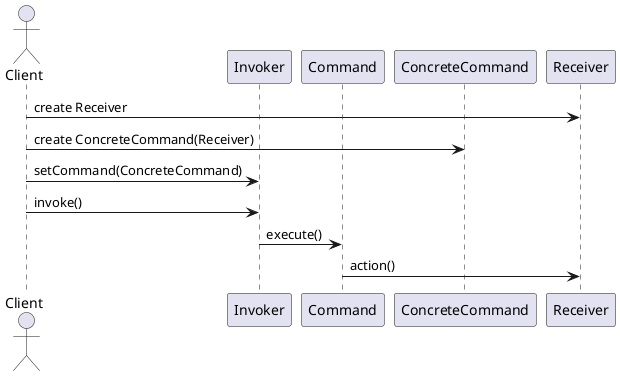

# 设计模式
## 目录
[toc]
## 精华
* 适配器模式与装饰者模式可以看成组合模式中的只有一个节点的容器。
  * 适配器模式通过将一个新任务委派给节点来达成扩展
  * 装饰模式通过将任务委派给节点并额外干点事儿，来达成扩展
## 创建型模式
### 工厂方法模式 VirtualConstructor; FactoryMethod; 虚拟构造函数
#### 类图
```plantuml
interface Product {
    + doStuff()
}
class ConProA as "ConcreteProductA\n具体产品A" implements Product
class ConProB as "ConcreteProductB\n具体产品B" implements Product
class Creator {
    - ...
    + someOperation()
    + createProduct(): Product
}
Creator .right.> Product
class ConcreateCreatorA extends Creator {
    - ...
    + createProduct(): Product
}
class ConcreateCreatorB extends Creator {
    - ...
    + createProduct(): Product
}
```
## 结构型模式
### 适配器模式 Adapter
#### 类图
1. 对象适配器
   ```plantuml
   class Client
   interface ClientInterface {
       + method(data)
   }
   class Adapter implements ClientInterface {
       - adaptee: Service
       + method(data)
   }
   note left : 使用**Service**提供的功能\n实现**ClientInterface**的接口
   class Service {
       - ...
       + serviceMethod(specialData)
   }
   Client -> ClientInterface
   Adapter -> Service
   ```
2. 类适配器（需要支持类的多重继承）
   ```plantuml
   class Client
   class Service {
       - ...
       + serviceMethod(specialData)
   }
   abstract ExistingClass {
       - ...
       + method(data)
   }
   class Adapter extends ExistingClass, Service{
       - ...
       + method(data)
   }
   note left : 使用继承自**Service**的功能\n重写**ExistingClass**的方法
   Client -> ExistingClass
   ```
#### 应用场景
* 想用某类，但接口不兼容。（比如：遗留类、第三方类、怪异接口类）
* 若需复用某些类（鸟），处于同一个继承体系（动物类），并且他们又有了额外的共性（会飞）
  但共性并非所有在这一个继承体系中的子类所具有（猫狗）。
  * 原本结构：
    ```plantuml
    abstract Animal {
        + makeSound(): void
    }
    class Dog extends Animal {
        + makeSound(): void
    }
    class Cat extends Animal {
        + makeSound(): void
    }
    class Bird extends Animal {
        + makeSound(): void
        + fly(): void
    }
    class OriginClient
    OriginClient -right-> Animal
    class Client
    Client .down.> Bird::fly : 要复用会飞的动物
    ```

  * 坏方案：
    ```plantuml
    note as N1
        必须在所有子类中重复添加缺失功能（会飞）
    end note
    abstract Animal {
        + makeSound(): void
        + <color:red>fly(): void</color>
    }
    class Dog extends Animal {
        + makeSound(): void
        + <color:red>fly(): void</color>
    }
    class Cat extends Animal {
        + makeSound(): void
        + <color:red>fly(): void</color>
    }
    class Bird extends Animal {
        + makeSound(): void
        + fly(): void
    }
    class Client
    Client -left-> Animal
    note left of Animal::fly
        将缺少的功能添加到子类中
    end note
    ```
  * 好选择：
    ```plantuml
    note as N1
        将缺失功能添加到适配器类中，
    end note
    abstract Animal {
        + makeSound(): void
    }
    abstract Flyable as "<color:red>Flyable</color>" extends Animal{
        + fly(): void
    }
    class Dog extends Animal {
        + makeSound(): void
    }
    class Cat extends Animal {
        + makeSound(): void
    }
    class Bird extends Flyable {
        + makeSound(): void
        + fly(): void
    }
    class FlyingAdapter as "<color:red>FlyingAdapter</color>" extends Flyable{
        - animal: Animal
        + FlyingAdapter(animal: Animal)
        + makeSound(): void
        + fly():void
    }
    note left of FlyingAdapter
        FlyingAdapter的做法与装饰模式很像
        都是通过新类组合已有类来扩展能力：
            适配器模式扩展的是该类不具备的能力
            装饰模式扩展的是该类已具备的能力
        需注意FlyingAdapter不应组合Bird，
        这样相当于重写了Bird的fly，
        而装饰模式是在自己的fly中调用Bird的fly
    end note
    FlyingAdapter o-left> Animal
    class Client
    Client -up-> Flyable
    ```
#### 遗留问题
* 第二个应用场景和装饰模式非常相似， 原因？
* 优缺点看不懂，需要学习一下各种原则
* 与其他模式的关系等弄完其他模式再说。
### 桥接模式 Bridge
#### 类图
```plantuml
class Client
package 桥接 <<Rectangle>> {
    class Abstraction as "Abstraction\n抽象部分" {
        - i: Implementation
        + feature1()
        + feature2()
    }
    interface Implementation as "Implementation\n实现部分" {
        + methode1()
        + methode2()
        + methode3()
    }
    Abstraction o-> Implementation
}
Client --> Abstraction
class RefAbs as "Refined Abstraction\n精确抽象" {
    ...
    + featureN()
}
class ConImp as "Concrete Implementations\n具体实现"
RefAbs -up-|> Abstraction
ConImp .up.|> Implementation
```
### 组合模式 Composite; ObjectTree;
#### 类图
```plantuml
class Client
interface Component {
    + execute()
}
class Composite implements Component {
    - children: Component[]
    + add(c: Component)
    + remove(c: Component)
    + getChildren(): Component[]
    + execute()
}
note bottom
    add; remove; getChildren
    亦可存在于Componet中。
    虽然违反接口隔离原则，
    但可使客户端无差别访问。
end note
note right of Composite::execute
    将工作委派给子元素
end note
class Leaf implements Component {
    - ...
    + execute()
}
Client -> Component
Composite o-> Component
```
#### 应用场景
* 如果有树状结构，即可考虑使用组合模式
#### 遗留问题
* 应用场景2所描述的不就是多态吗？不够成为一个应用场景啊。
* 缺点 需要细细品味
* 与其他模式有超级多关系
### 装饰模式 Wrapper; Decorator;
#### 类图
```plantuml
class Client
interface Component <<interface>> {
    + execute()
}
class ConCom as "Concrete Component\n具体部件" implements Component {
    - ...
    + execute();
}
abstract BasDec as "Base Decorator\n基础装饰" implements Component {
    - wrappee: Component
    + BaseDecorator(c: Component)
    + execute() <color:red>{wrappee.execute();}</color>
}
BasDec o-> Component
class ConDec as "Concrete Decorators\n具体装饰" extends BasDec {
    + extra() 额外功能
    + execute() <color:red>{surper::execute();extra();}</color>
}
Client -> Component
```
#### 应用场景
* 无需修改代码，且希望在运行时为对象新增额外行为
* 无法使用继承来扩展对象行为（final最终 或 难以实现）
* 例子
  * 已有一个提供通知功能的库
    ```plantuml
    package NotifierLibrary as "通知库" {
        abstract Notifier {
            + send(message)
        }
        class EmailNotifier extends Notifier
        class QQNotifier extends Notifier
        class WeChatNotifier extends Notifier
    class Application {
        - notifier: Notifier
    + setNotifier(notifier)
    + doSomething() 调用Notifier::send方法
    }
    Application -> Notifier
    ```
  * 当某个事件重要且紧急，需要多渠道的通知
    坏方案：
    ```plantuml
    package NotifierLibrary as "通知库" {
        note as N1
            该方案采用继承思想，有几个严重问题：
                继承是静态的，无法在运行时更改。只能使用由子类来代替整个对象
                多数语言不允许继承多个父类（cpp可以），但存在方法是final（override）的。
        end note
        abstract Notifier {
            + send(message)
        }
        class EmailNotifier extends Notifier
        class QQNotifier extends Notifier
        class WeChatNotifier extends Notifier
        class EQN as "<color:red>Email + QQ Notifier" extends Notifier
        class EQWN as "<color:red>Email + QQ + WeChat Notifier" extends Notifier
        class QWN as "<color:red>QQ + WeChat Notifier" extends QQNotifier, WeChatNotifier {
            + send(message) 需要对象上转型
        }
    }
    ```
    我想的方案（好像就是组合模式...）：
    ```plantuml
    package NotifierLibrary as "通知库" {
        abstract Notifier {
            + send(message)
        }
        class EmailNotifier extends Notifier
        class QQNotifier extends Notifier
        class WeChatNotifier extends Notifier
        class CompositeNotifier  as "<color:red>CompositeNotifier" extends Notifier {
            - children: Notifier[]
            + add(c: Notifier)
            + remove(c: Notifier)
            + send(message)
        }
        CompositeNotifier o-> Notifier
    }
    ```
    装饰模式
    ```plantuml
    package NotifierLibrary as "通知库" {
        abstract Notifier {
            + send(message)
        }
        class BaseDecorator as "<color:red>BaseDecorator" extends Notifier {
            - wrappee: Notifier
            + BaseDecorator(notifier)
            + send(message)
        }
        BaseDecorator o-> Notifier
        class EmailDecorator as "<color:red>EmailDecorator" extends BaseDecorator
        class QQDecorator as "<color:red>QQDecorator" extends BaseDecorator
        class WeChatDecorator as "<color:red>WeChatDecorator" extends BaseDecorator
    }
    ```
### 外观模式 Facade 
#### 类图
```plantuml
class Client
class Facade {
    - linksToSubsystemObjects 链接其他子系统的对象
    - optionalAdditionalFacade 可选的额外外观
    + subsystemOpteration()
}
Client -> Facade
class AddFac as "Additional\nFacade" {
    - ...
    + anotherOperation()
}
Facade -> AddFac
package OtherSubsystem <<Cloud>> {
    class SubsystemClass1
    class SubsystemClass2
    class SubsystemClass3
    class SubsystemClass4
}
Facade ...> OtherSubsystem 
Facade ...> OtherSubsystem 
Facade ...> OtherSubsystem 
AddFac ...> OtherSubsystem 
AddFac ...> OtherSubsystem 
```
### 享元模式 Cache; Flyweight; 缓存
#### 类图
```plantuml
class Client
class Context {
    - uniqueState 特有状态
    - repeatingState 重复的状态，是个标识
    + Context(repeatingState, uniqueState)
    + operation()
}
Client *-down-> Context
note right of Context::operation
factory::getFlyweight(repeatingState)
    .operation(uniqueState)
end note
class FlyweightFactory {
    - cache: Flyweight[]
    + getFlyweight(repeatingState)
}
note left of FlyweightFactory
这个工厂模式和单例模式只有一步之遥
end note
class Flyweight {
    - repeatingState
    + operation(uniqueState)
}
FlyweightFactory o--> Flyweight
Context -left-> FlyweightFactory
Context -left-> Flyweight
```
#### 引用场景
* 当程序需要大量相似（相似代表有大量重复状态）对象时，可因内存不足而采用享元模式
### 代理模式 Proxy - 完成
```plantuml
class Client
interface ServiceInterface {
    + opteration()
}
Client -> ServiceInterface 
class Service implements ServiceInterface {
    - ...
    + opteration()
}
class Proxy implements ServiceInterface {
    - realService: Service
    + Proxy(s: Service)
    + checkAccess()
    + opteration()
}
Proxy o-> Service
```
#### 应用场景
* 延迟初始化（虚拟代理）
* 访问控制（保护代理）
* 本地执行远程服务（远程代理）
* 记录日志请求（日志记录代理）
* 缓存请求结果（缓存代理）
* 智能引用，有点像智能指针，计数用户，为0时销毁。
#### 与其他模式的关系
* |模式|能为被封装对象提供|
  |-|-|
  |Adapter|不同的接口|
  |Proxy|相同的接口|
  |Decorator|持续加强的接口|
* Decorator与Proxy的不同意图
  * 代理通常自行管理服务对象的生命周期
  * 装饰通常由客户端进行控制
* Facade与Proxy的异同
  * 相同点：自行管理服务对象的生命周期
  * 不同点：代理与服务对象遵循同一接口，外观则不同

## 行为模式
### 责任链模式 Chain of Responsibility; CoR; 命令链; Chain of Command; 职责链模式
#### 类图
```plantuml
class Client
class Handler <<interface>> {
    + setNext(handler: Handler)
    + handle(request)
}
class BaseHandler implements Handler {
    - next: Handler
    + setNext(h: Handler)
    + handle(request)
}
class ConcreteHandler1 extends BaseHandler {
    - ...
    + handle(request)
}
BaseHandler o--> Handler
Client -> Handler
```
### 命令模式 Command; 动作; 事务; Action; Transaction
#### 类图
```plantuml
class Client
class Invoker {
    - command: Command
    + setCommand(command: Command)
    + executeCommand()
}
class Command <<interface>> {
    + execute()
}
class ConcreteCommand1 implements Command {
    - receiver
    - params
    + ConcreteCommand1(receiver, params)
    + execute()
}
class Receiver {
    - ...
    + operation(params)
}
ConcreteCommand1 -> Receiver
Invoker -> Command
Client -> Invoker
Client -left-> Receiver
Client .> ConcreteCommand1
```
### 策略模式 Strategy
#### 类图
```plantuml
class Context {
    - strategy
    + setStrategy(strategy)
    + executeStrategy()
}
class Strategy <<interface>> {
    + execute(data)
}
class ConcreteStrategyA implements Strategy {
    - ...
    + execute(data)
}
Client -> Context
Client .> ConcreteStrategyA
Context o-> Strategy

```
#### 记录
* 命令模式和策略模式作用上比较像, 两者都将某种行为**参数化**使成为对象. 但他们的意图不同.
  命令模式是将**执行某个命令**这一行为参数化为一个**命令**对象
  策略模式是将**执行某种算法或动作**这一行为参数化为一个**策略**对象
  意图区别在于:
  * 命令模式善于将命令延时执行; 将命令存储; 将命令分布式调用; 解耦调用者与执行者.
  * 策略模式善于将动作独立出来; 动态切换动作.
### 模板方法模式 Template Method
#### 类图
```plantuml
class AbstractClass {
    + templateMethod()
    + step1()
    + {abstract} hook2()
    + step3()
}
class ConcreteClassA extends AbstractClass {
    - ...
    + hook2()
}
class ConcreteClassB extends AbstractClass {
    - ...
    + hook2()
}
```
#### 记录
* 工厂方法模式是模板方法模式的一种特殊形式。
* 模板方法基于继承，在类层次上运作，因此它是静态的；策略模式基于组合，在对象层次上运作，因此可以运行时切换行为。
### 观察者模式 Observer; 事件订阅者 Event-Subscriber; 监听者 Listener
#### 类图
```plantuml
class Publisher {
    - subscribers: Subscriber[]
    + subscribe(s: Subscriber)
    + unsubscribe(s: Subscriber)
    + notifySubscribers()
}
class Subscriber <<interface>> {
    + update(context)
}
class ConcreteSubscriberA implements Subscriber {
    - ...
    + update(context)
}
Publisher o-> Subscriber
Client -> Publisher
Client .> ConcreteSubscriberA


```
要实现一个程序，具有ui；程序有几种内部状态，不同的状态ui上能干的事情不一样；状态的改变可能由外部（非ui）触发。
我觉得 命令模式、状态模式、观察者模式 均有可取之处，状态模式可以使得状态的转换逻辑独立清晰；命令模式可以将命令对象化，延迟处理；观察者模式有利于隔离ui逻辑与状态更改的逻辑。
但是我无法画出类图， 你可以吗？ 最好用plantuml表达。



