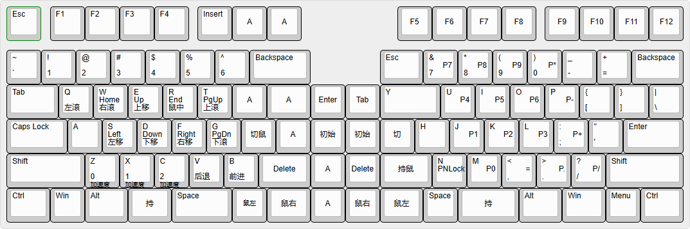

# 键盘计划
## 目的
*   制作键盘学习到的知识记录
*   制作键盘的过程记录
*   键盘相关的资源与方向
## 资源
### 开源项目
*   [ErgoDox](https://github.com/Ergodox-io/ErgoDox)
*   [QMK键盘固件](https://qmk.fm/); [中文版文档](https://github.com/samhocevar-forks/qmk-firmware/blob/master/docs/zh-cn/README.md); [github](https://github.com/qmk/qmk_firmware)
*   [TMK键盘固件](https://github.com/tmk/tmk_keyboard)是QMK的基础
*   [VIA](https://www.caniusevia.com/)可能和固件烧录有关
*   百度网盘资料可供参考：`八戒DIY群共享.zip`

## 现行的键位布局
